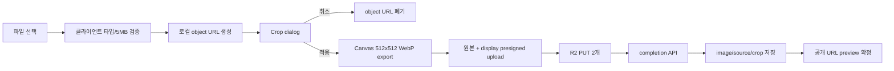

# 프로필 이미지 크롭 설계

## 목적

페이지 편집기의 프로필 이미지에 1:1 크롭 기능을 추가한다. 사용자가 업로드 전에
이미지의 위치와 확대 배율을 조정하고, 1:1 crop viewport 결과를 확인한 뒤
확정한다.

이 문서는 2026-08-01 기준으로 현재 Sinabro 코드와 공개 라이브러리 문서,
Reddit 커뮤니티 논의를 조사한 결과다. 구현은 이 문서를 기준으로 진행한다.

## 현재 경계

- `PageImageEditor`가 파일 선택, 로컬 blob preview, 업로드 완료 후
  `onImageChange` 호출을 소유한다.
- 현재 파일을 선택하면 곧바로 presigned PUT과 completion 요청을 수행한다.
- `pages.image`에는 이미지 URL이 아니라 R2 object key만 저장한다.
- 크롭 버튼은 이미 렌더링되어 있지만 `onClick`과 크롭 상태가 없다.
- 백엔드는 profile image에 대해 최대 5 MB와 이미지 MIME 타입을 검증하고,
  완료 시 이전 profile object를 삭제한다.
- public 페이지는 기존처럼 R2 URL을 `img`에 넣고 `object-cover`로 표시한다.

따라서 최종 crop raster만 저장해서는 안 된다. `pages.image`는 public page가
표시하는 최종 raster key로 유지하되, 별도로 원본 source key와 원본 기준 crop
좌표를 저장한다. 재크롭할 때는 항상 원본 source를 열고 이전 crop 좌표를
`initialCroppedAreaPercentages`로 복원한다.

## 조사 결과

### 라이브러리 비교

| 후보 | 장점 | 리스크/부적합 | 판단 |
| --- | --- | --- | --- |
| `react-easy-crop` | drag, zoom, pinch, keyboard, round crop, pixel/percentage 결과를 제공한다. React/TypeScript에서 프로필 이미지 UX를 만들기 쉽다. | crop 결과를 직접 `File`로 만들어 업로드해야 한다. modal 크기를 여는 동안 scale 애니메이션을 사용하면 cropper 크기가 잘못 계산될 수 있다. | **선택** |
| `react-image-crop` | 의존성 없음, 5 KB 미만 gzip, touch와 keyboard 접근성, 고정 aspect ratio를 제공한다. | 기본 UX가 crop selection을 움직이거나 resize하는 방식이다. 원형 고정 프레임 안에서 이미지를 이동시키는 avatar UX와 canvas/EXIF 처리를 직접 더 많이 작성해야 한다. | 작은 bundle이 최우선일 때 대안 |
| `react-cropper` + Cropper.js | 성숙한 crop box, 모서리 핸들, zoom/rotate/EXIF 관련 옵션과 canvas 출력을 제공한다. | 프로필 사진 하나에는 API와 CSS가 넓고 무겁다. | 기능이 확장될 때만 고려 |
| `react-advanced-cropper` | stencil과 handler를 세밀하게 교체할 수 있고 mobile/desktop, zoom, rotate를 지원한다. | 현재 npm 문서가 beta API를 명시하고, 최신 버전이 1년 전에 배포됐으며 유지보수자가 1명이다. | 현재는 제외 |
| `react-avatar-editor` | avatar 전용이고 비교적 작다. | Reddit 사용자는 UI가 clunky하다고 평가했다. | 현재는 제외 |
| Pintura | crop 외 rotate, filter, annotate까지 완성도 높은 편집기를 제공한다. | 상용 제품이고 이번 요구보다 범위와 비용이 크다. | 향후 풀 이미지 에디터가 필요할 때 |

근거:

- [`react-easy-crop` README](https://github.com/ValentinH/react-easy-crop)와
  [npm 문서](https://www.npmjs.com/package/react-easy-crop)는 mobile-friendly
  drag/zoom/rotate, round crop, pixel/percentage 결과를 제공한다고 명시한다.
  또한 modal이 열릴 때 크기가 바뀌는 scale 애니메이션을 피하라고 안내한다.
- [`react-image-crop` npm 문서](https://www.npmjs.com/package/react-image-crop)는
  zero dependency, 5 KB 미만 gzip, keyboard accessibility, fixed/free-form
  crop을 명시하지만 EXIF 보정과 canvas 출력은 애플리케이션이 조합해야 한다.
- [`react-cropper` 문서](https://react-cropper.github.io/react-cropper/)는
  Cropper.js 옵션과 `getCroppedCanvas()`를 노출한다.
- [`react-advanced-cropper` npm 문서](https://www.npmjs.com/package/react-advanced-cropper)는
  beta API와 고급 stencil customization을 명시한다.

### 실제 커뮤니티 신호

Reddit의 실제 사용자는 하나의 정답보다 다음 트레이드오프를 반복해서 언급했다.

- [프로필 이미지용 cropper 비교 글](https://www.reddit.com/r/reactjs/comments/1d5ca75)은
  Cropper.js wrapper는 좋아 보이지만 의존성이 커서 부담스럽고,
  `react-avatar-editor`는 작지만 UI가 어색하며, `react-easy-crop`은 원형 crop과
  pinch zoom을 제공해 실제로 적용하기 좋다는 의견을 담고 있다.
- [이미지 crop/upload 질문](https://www.reddit.com/r/reactjs/comments/wmzqwi)은
  업로드 전에 결과 avatar를 미리 보고 싶을 때 `react-avatar-editor`를
  추천받은 사례다.
- [Cropper.js 사용 질문](https://www.reddit.com/r/react/comments/12h3jct)은
  다양한 방향의 이미지가 profile picture에서 잘못 배치되는 문제 때문에
  crop을 업로드 파이프라인에 넣으려는 실제 요구를 보여준다.
- [GIF/WebP 논의](https://www.reddit.com/r/react/comments/1cznw5l)은
  `react-easy-crop`의 포맷 지원을 장점으로 보면서도, corner handle이 필요하면
  다른 라이브러리를 찾게 된다는 반대 의견을 보여준다.
- [고정 프레임 UX 논의](https://www.reddit.com/r/reactjs/comments/1aw7lwl)은
  crop box를 움직이는 UI보다 이미지 자체를 고정 경계 안에서 이동시키는 UX를
  원한다는 요구를 보여준다. 이는 이번 avatar UX를 `react-easy-crop`으로
  선택한 직접적인 근거다.

X는 공식적으로 profile image를 400×400으로 권장하고, 업로드 후 `Apply`를
눌러야 저장된다고 안내한다. 따라서 Sinabro도 미리보기와 별도의 명시적인
`적용` 동작을 둔다. [X profile photo upload 안내](https://help.x.com/en/managing-your-account/common-issues-when-uploading-profile-photo)

X의 공개 검색 페이지는 이 환경에서 로그인/동적 렌더링으로 개별 게시물 내용을
검증할 수 없었다. 확인하지 못한 X 게시물의 의견을 만들어 인용하지 않고, X는
공식 제품 동작의 참고로만 사용하며 커뮤니티 의견은 위 Reddit 사례로 한정한다.

## 결정 사항

### UX

1. 이미지 선택 버튼과 기존 이미지의 크롭 버튼 모두 같은 `CropProfileImageDialog`
   를 연다.
2. 새 파일을 선택해도 `적용` 전에는 네트워크 요청을 하지 않는다.
3. dialog 안에서는 투명한 surface 위에 원형 1:1 crop viewport를 고정한다. 사용자는 프레임 안의 이미지를
   drag/pan하고, wheel 또는 pinch, zoom slider와 +/- 버튼으로 확대한다.
4. 1차 범위에서는 사용자 회전과 free-form ratio를 제공하지 않는다. 모바일
   사진의 EXIF orientation은 export 전에 자동 정규화한다.
5. `취소`는 선택한 파일과 crop 상태를 폐기하고 현재 저장된 이미지를 유지한다.
6. `적용`은 먼저 로컬 `512×512` crop preview를 확정하고 그 preview를 사용해
   dialog를 닫는다. R2 업로드와 page persistence는 닫힘 transition과 병렬로
   진행한다. 성공하면 local preview를 public R2 URL로 조용히 교체하고,
   실패하면 기존 이미지로 되돌린다.
7. crop dialog는 흰색 panel background 없이 이미지 중심의 투명한 surface를 사용한다.
   fade/slide만 사용하고 scale-in 애니메이션을 사용하지 않는다.
   현재 공통 `DialogContent`의 zoom-in 기본 동작을 이 dialog에서 override한다.
   Cropper는 부모가 `position: relative`이고 고정 높이를 가진 영역 안에 mount한다.
   shared 원형 이미지가 도착한 뒤 Cropper surface는 250ms ease-out으로 원형에서
   최종 사각 viewport로 morph한다. 전환 중에는 2px blur를 사용해 두 media layer의
   모양 교체가 갑작스럽게 보이지 않게 한다.

### Shared image transition UI

이 동작의 정확한 용어는 **shared element transition**이다. 프로필 이미지가
dialog 안으로 이동하고 커지는 부분은 `layoutId` 기반의 shared element이고,
dialog 내부에서 cropper와 controls가 나타나는 부분은 별도의 `layout animation`
및 opacity transition으로 분리한다. modal 전체를 단순히 scale-in하는 방식으로
대체하지 않는다.

구현 시 다음 두 스킬을 반드시 사용한다.

- [`transitions-dev`](/Users/kinmongsang/.agents/skills/transitions-dev/SKILL.md):
  modal/backdrop의 semantic motion token, close-state cleanup, 정확한 property
  transition, `prefers-reduced-motion` guard를 적용한다.
- [`emil-design-eng`](/Users/kinmongsang/.agents/skills/emil-design-eng/SKILL.md):
  shared image의 spatial consistency, ease-out 응답성, 300ms 이하의 UI timing,
  interruptible motion, keyboard/touch 접근성 기준을 적용한다.
- [`Ponytail:ponytail`](/Users/kinmongsang/.codex/plugins/cache/ponytail/ponytail/4.8.4/skills/ponytail/SKILL.md),
  full intensity: 기존 코드와 브라우저 native 기능을 먼저 재사용하고, 필요한
  최소 모듈만 추가한다. 별도의 state library, image pipeline service, generic
  media-editor abstraction, animation library를 추가하지 않는다.

#### 상태 구조

```text
closed
  └─ open request
opening
  ├─ backdrop: fade in
  ├─ image: profile position → dialog crop viewport
  └─ controls: hidden until image settles
open
  └─ cropper interaction enabled
closing
  ├─ controls: fade out
  ├─ image: dialog crop viewport → profile position
  └─ backdrop: fade out
```

#### 구현 규칙

- `motion/react`의 `LayoutGroup`으로 profile trigger와 dialog portal을 같은
  projection scope에 둔다.
- trigger image와 dialog의 실제 media element에 동일하고 page-scoped인
  `layoutId`, 예를 들어 `profile-image-${pageId}`, 를 사용한다.
- `layoutId`는 dialog 전체나 버튼, cropper wrapper가 아니라 실제 shared
  `motion.img`에 둔다. shared image가 정착하면 해당 visual layer를 숨기고,
  Cropper의 단일 편집 image만 남겨 같은 이미지가 겹쳐 보이지 않게 한다.
  title, zoom control, footer가 같이 날아다니면 shared image의 정체성이 흐려진다.
- `AnimatePresence`는 `mode="sync"`로 사용한다. source와 target이 동시에
  mount된 상태에서 Motion이 두 layout을 측정해야 하므로 `mode="wait"`를
  사용하지 않는다.
- modal surface의 크기와 crop viewport의 최종 크기는 고정된 상태로 mount한다.
  modal이 열리면서 width/height를 다시 계산하거나 scale되면 cropper의 측정과
  shared projection이 서로 싸우게 된다.
- 기존 `DialogContent`의 `zoom-in-95`/`zoom-out-95`는 이 dialog에서 끈다.
  modal chrome은 `transitions-dev`의 modal token을 사용하되, shared image의
  target wrapper에는 별도 scale을 중첩하지 않는다.
- modal chrome/backdrop에는 `transitions-dev`의 `t-modal` hook과 close-state
  cleanup을 사용한다. 해당 스킬의 reduced-motion block을 유지하고, 이미 전역에
  있는 token만 재사용한다. shared image가 scale을 담당하므로 이 modal 인스턴스의
  `--modal-scale`/`--modal-scale-close`는 `1`로 두어 이중 scale을 막는다.
- image 이동은 `transform` 기반 layout projection만 사용한다. `top`, `left`,
  `width`, `height`를 직접 transition하거나 `transition: all`을 사용하지 않는다.
- 기본 motion은 250ms 안쪽의 강한 ease-out 또는 기존 `SPRING_LAYOUT`을 사용하고,
  close는 150ms 안쪽으로 더 짧게 한다. close 중 Escape나 재클릭이 들어오면
  현재 위치에서 반대 방향으로 이어지는 interruptible motion이어야 한다.
- opening 중에는 cropper controls와 keyboard focus를 활성화하지 않는다. shared
  image가 정착한 뒤 dialog title 또는 cropper surface로 focus를 옮긴다.
- closing은 즉시 portal을 unmount하지 않는다. shared image가 profile 위치로
  돌아온 뒤 close duration을 읽어 portal을 제거하고 Crop 버튼으로 focus를
  반환한다.
- pointer/touch로 연 경우 shared transition을 사용한다. keyboard activation이나
  `prefers-reduced-motion: reduce`에서는 위치 이동을 제거하고 opacity/focus
  변화만 사용한다.
- backdrop은 이미지와 별개의 layer로 fade한다. cropper가 interactive일 때만
  pointer events를 활성화하고, closing 중에는 pointer events를 차단한다.

#### 모션 토큰 역할 분리

| 대상 | 구현 | 기준 |
| --- | --- | --- |
| 프로필 이미지 ↔ crop viewport | Motion `layoutId` / `LayoutGroup` | shared element transition, `SPRING_LAYOUT` 또는 250ms ease-out |
| backdrop | transitions-dev modal/backdrop hook | open 250ms, close 150ms, opacity 중심 |
| title/zoom/footer | opacity + 2px blur reveal | image settle 뒤 40–80ms stagger |
| Crop/Cancel button press | exact `transform` transition | active scale `0.97`, 100–160ms |
| reduced motion | CSS media query + `useReducedMotion` | 이동/scale 제거, opacity만 유지 |

이 구조가 “이미지가 모달로 이동한다”는 공간적 연속성을 담당하고, modal
background와 controls는 이미지 이동을 방해하지 않는 보조 motion만 담당한다.

#### Crop 적용 후 닫힘 handoff

크롭 적용 후의 닫힘은 다음 순서를 반드시 지킨다.

1. cropper의 현재 상태를 canvas로 export해 local `pendingDisplayUrl`을 만든다.
2. cropper media를 바로 profile 위치로 이동시키지 않는다. cropper와 같은 crop
   viewport 안에 정적인 `pendingDisplayUrl` preview를 먼저 놓고, cropper를
   짧게 fade out한다.
3. 이 static crop preview를 shared `layoutId` visual layer로 삼아 modal crop
   viewport에서 원래 profile image 위치로 이동시킨다.
4. profile trigger의 underlying image도 이동 시작 전에 같은
   `pendingDisplayUrl`로 바꾼다. 이동의 시작과 끝이 모두 crop 결과이며,
   기존 uncropped image가 중간에 다시 보이지 않는다.
5. shared image가 도착한 뒤 dialog portal을 제거한다. local preview는 upload가
   끝날 때까지 유지한다.

취소, Escape, backdrop close처럼 crop을 적용하지 않은 닫힘에서는
`committedImageUrl`을 shared visual source로 사용한다. 사용자가 crop을 확정한
경우에만 `pendingDisplayUrl`이 닫힘 transition의 source가 된다.

R2 persistence는 transition을 기다리지 않는다. 새 source/display upload와
completion은 백그라운드에서 진행하고, 성공 시 public crop URL로 교체한다.
실패 시 `pendingDisplayUrl`을 revoke하고 `committedImageUrl`로 복귀시키며,
profile editor의 upload error를 표시한다. 업로드 중에는 Change/Crop/Remove를
잠시 비활성화해 local preview와 persisted state가 경쟁하지 않게 한다.

### 이미지 결과물

- crop area: 1:1 round viewport
- preview shape: profile page와 crop frame 모두 round mask
- output: 512×512 WebP, quality 약 0.88
- 원본 source object와 최종 display object를 모두 R2에 저장한다.
- UUID는 원본 object를 생성할 때 한 번만 만든다. crop object를 위해 별도 UUID를
  생성하지 않고, 원본 key에서 UUID base를 가져와 suffix만 파생한다.
  - 원본: `users/{userId}/{pageId}/profile/{uuid}.{sourceExtension}`
  - crop: `users/{userId}/{pageId}/profile/{uuid}-crop.{displayExtension}`
- `pages.image`는 현재 public page에 표시할 display object key다.
- `pages.imageSource`는 재크롭에 사용할 immutable original object key다.
- `pages.imageCrop`은 원본 이미지 기준의 정규화된 crop 영역이다.
- 원형은 crop dialog와 public profile의 표시용 mask다. 파일 자체를 원형으로
  오려 투명 영역을 만들지 않는다. 그래야 public page의 기존
  `img`/`object-cover` 렌더링을 그대로 유지한다.
- crop 좌표는 DB에 저장하지만 zoom 자체는 저장하지 않는다. crop 영역만으로
  원본 위의 이전 선택 영역과 결과물을 재현할 수 있다.
- 새 crop을 적용할 때 display object만 교체하고 source object는 유지한다.
- 새 파일로 이미지를 교체할 때만 새 source/display 쌍을 만들고 이전 쌍을
  completion 이후 정리한다.

재크롭은 같은 `{uuid}-crop` key를 덮어쓴다. 따라서 crop object에는
`Cache-Control: no-cache, must-revalidate`를 적용하거나 public URL에 page의
`updatedAt` 기반 query string을 붙여 이전 crop 결과가 브라우저에 남지 않게 한다.

512×512는 현재 profile image가 desktop에서 최대 184px로 표시되는 것에 충분한
retina 여유를 주면서 400×400을 권장하는 X보다 조금 높은 내부 품질을 확보한다.

### 컴포넌트 구조

```text
PageImageEditor
├─ committedImageUrl / pendingDisplayUrl / transitionImageUrl
├─ source: File | existing public URL
├─ CropProfileImageDialog
│  ├─ react-easy-crop (aspect=1, cropShape=round, objectFit=contain, restrictPosition)
│  ├─ zoom controls
│  └─ Cancel / Apply
└─ uploadProfileImage({ sourceFile?, displayFile, crop })
```

`PageImageEditor`는 저장된 이미지와 임시 crop preview를 별도 상태로 둔다.
`initialImage` effect가 부모 autosave 업데이트 때문에 임시 preview를 덮어쓰지
않도록 upload 중에는 committed state만 동기화한다. blob URL은 새 source를
열 때와 dialog unmount 때 모두 revoke한다.

### 모듈식 조립과 유지보수 경계

모듈은 확장을 위한 빈 추상화가 아니라 실제 책임 경계로만 나눈다.

| 모듈 | 책임 | 외부로 노출하는 계약 |
| --- | --- | --- |
| `PageImageEditor` | trigger, shared transition lifecycle, optimistic preview, upload 상태 | `open`, `close`, `pendingDisplayUrl`, persistence 결과 |
| `CropProfileImageDialog` | cropper UI, zoom/pan, focus, Apply/Cancel | `sourceUrl`, `initialCrop`, `onApply`, `onCancel` |
| `crop-image.ts` | EXIF-aware canvas export와 File 생성 | `source`, `croppedAreaPixels` → `{ file, crop }` |
| `profile-image-api.ts` | presign, R2 PUT, completion 요청 | `uploadProfileImage(input)` |
| API/backend profile-image service | key ownership, object verification, crop 범위 검증, DB 저장/cleanup | source/display/crop response |

`react-easy-crop`의 타입은 `CropProfileImageDialog` 내부에서만 다룬다. API와
`PageImageEditor`는 `ProfileImageCrop`과 `CropApplyResult`만 알아야 한다. 향후
회전이나 뒤집기를 추가할 때도 cropper 타입을 전체 앱으로 전파하지 않고,
이 adapter 경계와 순수 canvas helper만 확장한다.

Ponytail 원칙에 따라 다음은 이번 구현에서 만들지 않는다.

- 한 곳에서만 사용되는 `ImageEditorContext`, `MediaUploadManager`, generic
  `SharedTransition` 컴포넌트
- crop history, undo stack, server-side image transformation pipeline
- 별도의 upload state library와 crop state library
- 현재 `motion/react`, `Dialog`, `SPRING_LAYOUT`, `uploadPageImage`를 대체하는
  새 기반 계층

이 단순화의 한계는 원본 한 개와 현재 crop 한 개만 지원한다는 점이다. history,
여러 media type, 서버 variant가 실제 요구가 될 때만 별도 모듈을 추가한다.

### 저장 계약

```ts
type ProfileImageCrop = {
  x: number;      // 0..100, original 기준 percentage
  y: number;      // 0..100, original 기준 percentage
  width: number;  // 0..100
  height: number; // 0..100
};
```

`x + width <= 100`, `y + height <= 100`, `width > 0`, `height > 0`을 backend가
검증한다. `react-easy-crop`의 percentage 결과를 저장하는 이유는 화면 크기나
원본 표시 크기가 달라져도 crop 위치를 재현할 수 있고, pixel 값을 반올림해
복원할 때 생기는 drift를 피할 수 있기 때문이다.

기존 response/DB와의 역할은 다음과 같다.

| 필드 | 의미 | 표시/편집 용도 |
| --- | --- | --- |
| `image` | 512×512 display WebP object key | public page의 `` source |
| `imageSource` | 업로드 원본 object key | 다음 crop dialog의 source |
| `imageCrop` | 원본 기준 percentage 영역 | dialog 초기 crop 복원 |

기존 row에 `imageSource`가 없는 경우에는 첫 재크롭에서 기존 `image`를 임시
source로 승격한다. 이미 과거에 destructive crop된 이미지는 그 시점 이전의
원본을 복구할 수 없지만, 기능 도입 이후의 crop부터는 원본을 보존한다.

업로드 API는 새 source가 있는지에 따라 두 가지를 처리한다.

- 신규/교체: `sourceFile`과 `displayFile`에 대한 presigned upload 2개를 발급한다.
- 신규/교체: 서버가 하나의 UUID base만 생성해 `{uuid}.{sourceExtension}`과
  `{uuid}-crop.{displayExtension}` key를 함께 발급한다.
- 재크롭: 기존 `imageSource`를 재사용하고 `displayFile` upload 1개만 발급한다.
- 재크롭: 기존 `imageSource`에서 UUID base를 추출해 `{uuid}-crop` key를
  재사용한다. 새 UUID는 생성하지 않는다.
- presigned display PUT은 completion 전용 staging key로 받고, completion이
  검증 후 최종 `{uuid}-crop.{displayExtension}` key로 승격한다. 최종 key는
  신규 업로드와 재크롭 모두 동일한 UUID 규칙을 따른다.
- upload 응답에는 presign 시점의 `image`, `imageSource`, `imageCrop`을
  `expectedImage`로 포함하고, completion 요청도 이를 돌려보낸다. completion은
  이 이미지 상태를 조건으로 DB를 갱신해, 이름·소개글 변경은 허용하면서 느린
  이전 이미지 작업이 최신 이미지를 덮어쓰지 않게 한다.
- completion 요청은 `sourceObjectKey`, `displayObjectKey`, `crop`,
  `expectedImage`를 받아 소유권, MIME, object 존재 여부와 crop 범위를 검증한
  뒤 `image`, `imageSource`, `imageCrop`을 함께 저장한다. 이미지 상태가 더 이상
  현재 page와 일치하지 않으면 `PROFILE_IMAGE_OPERATION_STALE` conflict를
  반환한다.

이렇게 하면 crop preview는 display raster로 즉시 표시할 수 있고, 다음 crop은
항상 original source와 저장된 percentage 영역을 함께 사용한다.

## 데이터 흐름

### 새 이미지



### 기존 이미지 재크롭

기존 이미지는 `imageSource`의 public R2 URL을 source로 연다. Canvas export의 tainted canvas를
피하려면 public R2 domain이 frontend origin에 대해 `GET`/`HEAD` CORS header를
반환해야 한다. source를 `fetch(..., { mode: "cors" })`로 Blob으로 읽어 local
object URL로 바꾸면 cropper와 export가 동일한 로컬 source를 사용한다.

dialog가 열릴 때 `imageCrop`이 있으면 이 영역을 원본 위에 초기 선택 영역으로
보여준다. 새 crop을 적용해도 source는 그대로 두고 display raster와
`imageCrop`만 교체한다. `imageSource`가 없는 legacy row는 현재 `image`를
fallback source로 사용한다.

기존 backend README에는 presigned `PUT` CORS만 문서화되어 있으므로, 구현 전에
R2 CORS 규칙에 다음을 추가하고 실제 응답으로 확인한다.

- 허용 origin: local frontend origin과 production frontend origin
- 허용 method: `GET`, `HEAD`, `PUT`
- 허용 request header: `Content-Type`, `Cache-Control`
- 노출 header: 필요 시 `Content-Length`, `ETag`

현재 원격 `test-images` 버킷은 `http://localhost:3000`에 대해 `GET`, `HEAD`,
`PUT`과 `Content-Type`, `Cache-Control`을 허용하며, presigned PUT preflight가
`204`와 두 request header를 반환하는 것까지 확인했다.

CORS가 실패하면 기존 이미지와 DB를 유지하고, “현재 이미지를 불러오지 못해
크롭할 수 없습니다” 오류를 보여준다. backend proxy를 새로 만드는 것은 이
범위의 기본 경로로 삼지 않는다.

## 구현 상세

### Cropper 설정

- `aspect={1}`
- `cropShape="round"`
- `objectFit="contain"`으로 zoom 1에서 세로 이미지는 이미지 너비를 crop width로,
  가로 이미지는 이미지 높이를 crop height로 사용한다.
- `showGrid={false}`
- `restrictPosition={true}`
- `zoom`은 1부터 3 사이에서 시작한다.
- `onCropComplete`의 `croppedAreaPixels`만 export 직전에 사용한다.
- `imageCrop`을 `initialCroppedAreaPercentages`로 전달해 기존 선택 영역을
  복원한다. percentage를 우선 사용하고 pixel 값은 export 시점에만 계산한다.
- Cropper container는 transparent로 두고, crop area 바깥의 box shadow만 외부
  backdrop과 같은 `rgba(0, 0, 0, 0.75)`를 사용한다. 별도의 검은 panel을 이미지
  뒤에 겹치지 않는다.
- cropper 결과를 File로 만드는 작은 canvas helper를 별도 모듈로 둔다.
  cropper 라이브러리와 업로드/R2 API를 한 컴포넌트에 섞지 않는다.

Canvas helper는 다음을 책임진다.

1. source image를 EXIF orientation이 반영된 상태로 로드한다.
2. `croppedAreaPixels`를 원본 좌표로 변환해 512×512 canvas에 그린다.
3. `canvas.toBlob("image/webp", 0.88)`로 display File을 만든다.
4. WebP export를 지원하지 않는 경우에만 JPEG fallback을 사용한다.
5. Blob/File 생성 실패와 지나치게 큰 결과물은 사용자 오류로 반환한다.

### 업로드 실패와 정리

- crop 적용 전에는 R2 object가 생성되지 않는다.
- 새 파일을 선택한 경우에만 원본과 display 두 object를 업로드한다. 기존
  source를 재사용하는 재크롭은 display object만 업로드한다.
- presign, PUT, completion 중 하나라도 실패하면 `onImageChange`를 호출하지
  않고 committed image를 유지한다.
- completion은 source/display key와 crop metadata를 모두 검증한 뒤 함께 저장한다.
- completion은 staging display를 최종 display key로 승격하며, DB 저장 실패 시
  기존 최종 display object를 복원한 뒤 staging object를 정리한다.
- 새 파일로 교체할 때 backend는 completion 이후 이전 display와 source object를
  삭제한다. 재크롭에서는 이전 source를 삭제하지 않는다.
- 재크롭은 동일한 `{uuid}-crop.{extension}` object key를 덮어쓰므로 completion 응답의
  `page.updatedAt`을 public URL의 `?v=` cache version으로 사용한다. object key 규칙은
  UUID 기반으로 유지하고, 화면은 완료 직후 새 URL을 사용한다.
- 새 crop source와 pending preview의 object URL은 성공/실패/취소/언마운트
  모든 경로에서 revoke한다.

## 변경 범위

예상 변경 파일:

- `apps/frontend/src/components/page/page-image-editor.tsx`
  - 즉시 upload를 crop-first flow로 변경
  - crop dialog open/close, pending preview, upload 상태 추가
- `apps/frontend/src/components/page/crop-profile-image-dialog.tsx`
  - 새 dialog와 crop controls 추가
- `apps/frontend/src/lib/image/crop-image.ts`
  - canvas export, EXIF orientation, Blob/File 변환
- `apps/frontend/package.json` 및 `bun.lock`
  - `react-easy-crop` 추가
- `apps/backend/src/db/schema.ts`와 migration
  - `image_source`, `image_crop` 추가
- `packages/api/src/index.ts`
  - `ProfileImageCrop`와 page response/upload completion contract 추가
- profile image service/controller
  - source/display 2-object upload과 crop metadata 검증
- `use-page-auto-save`/`PageImageEditor` props
  - source key와 crop metadata를 profile image completion 결과와 동기화
- R2 CORS 설정/문서
  - existing image 재크롭을 위한 `GET`/`HEAD` 허용 추가
- public page 응답
  - 소유자 외 viewer에게는 `imageSource`/`imageCrop`을 노출하지 않음

## 검증 기준

프론트엔드 테스트 파일은 추가하지 않는다. 정적 검사와 실제 browser/R2 경계
검증을 분리한다.

### 정적 검증

- frontend typecheck와 Biome check
- crop helper의 TypeScript 타입 검증
- `react-easy-crop` CSS가 한 번만 로드되는지 확인
- backend migration, API schema/service가 source/display/crop 계약과 일치하는지 확인

### 수동 QA

#### CROP-01: 새 이미지의 1:1 crop

- Given: 로그인한 사용자가 편집 모드이고 가로로 긴 이미지 파일을 준비한다.
- When: 파일을 선택하고 이미지를 이동/확대한 뒤 `적용`을 누른다.
- Then: 1:1 preview가 선택한 위치를 보여주고, completion 성공 후 display key,
  source key, percentage crop이 함께 저장된다. R2에는 원본과 512×512 display
  결과물이 모두 존재한다.
- Evidence: browser 화면, presign/PUT/completion Network, R2 `HEAD` 2개,
  결과 이미지 `naturalWidth`/`naturalHeight`, DB page row.

#### CROP-02: 취소와 적용 전 이탈

- Given: crop dialog가 열린 상태다.
- When: `취소` 또는 Escape를 누른다.
- Then: R2/API 요청이 없고 기존 이미지와 DB row가 바뀌지 않는다.
- Evidence: Network 요청 부재, 기존 image key, 화면 preview.

#### CROP-03: 기존 이미지 재크롭

- Given: 이미 저장된 profile image가 있고 public R2 CORS가 설정되어 있다.
- When: 크롭 버튼을 누르고 위치를 변경해 적용한다.
- Then: 저장된 `imageCrop` 영역이 원본 위에 초기 선택 영역으로 복원되고,
  display key와 crop metadata만 교체된다. `imageSource`와 원본 object는
  유지된다.
- Evidence: `GET` response CORS header, 복원된 crop 화면, R2 object 목록,
  DB row의 source/display/crop 값.

#### CROP-04: 모바일 제스처와 접근성

- Given: 모바일 viewport 또는 touch device다.
- When: pinch, drag, zoom control, keyboard focus를 사용한다.
- Then: 1:1 프레임 밖에 빈 영역이 생기지 않고, controls는 label/focus 상태를
  가지며 Escape로 취소할 수 있다.
- Evidence: 실제 browser touch/keyboard interaction, focus outline, reduced-motion
  환경 화면.

#### CROP-05: EXIF/실패 경로

- Given: 세로 방향 EXIF가 있는 휴대폰 사진과 5 MB 초과/지원하지 않는 파일을
  각각 준비한다.
- When: 업로드와 적용을 시도한다.
- Then: 세로 사진은 기울어지지 않고, invalid file은 API 요청 전에 거절된다.
  upload/completion 실패 시 기존 이미지와 DB는 유지된다.
- Evidence: source와 결과 preview 비교, client log/Network, DB row, old/new R2
  object 상태.

#### CROP-06: modal layout stability

- Given: crop dialog를 연다.
- When: open animation과 이미지 load가 완료된다.
- Then: crop frame 크기와 이미지 위치가 튀지 않고, scale-in 없이 fade/slide만
  동작한다.
- Evidence: 실제 browser recording 또는 screenshot sequence, computed dialog size.

## 후속 범위

- 원본 object의 버전 history와 사용자가 이전 crop으로 되돌리는 기능
- 사용자 회전/뒤집기와 free-form ratio
- 얼굴 중심 자동 crop
- 서버/Cloudflare Images 기반 variant 생성
- crop 결과 품질과 파일 크기에 따른 adaptive compression
